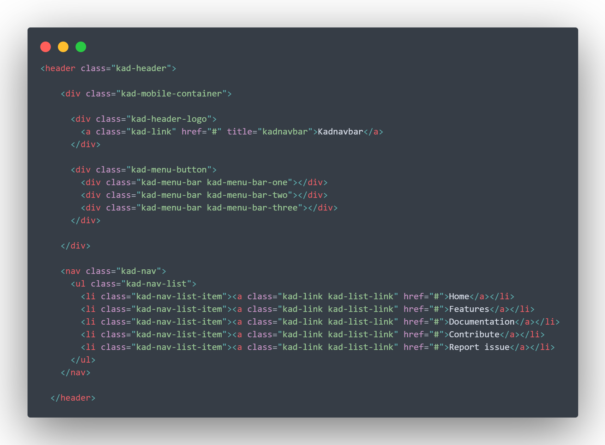

<div align="center">

# Kadnavbar

Responsive navbar with zero bootstrap/jQuery dependencies and css cross-bow nav button animation.

[](http://opensource.org/licenses/MIT)




</div>


## Features

* No jQuery or external js libraries
* Completely independent 
* Doesn't break main stylesheet
* All animations are css animations
* Can accomodate various range of nav brand size
* Semantic html markup
* Extra support for [font-awesome](https://fontawesome.com/) icons

## Documentation

Complete documentation is available in the [github page demo of the repo](https://github.com/kadetXx/kadnavbar). For a quick start, see usage guide below

## Quick Start Guide

You can either download asset folder and link up in your html code or link to files directly from github servers.

### Using github servers

1. Copy and paste the css link below into your index.html file in the header. This link should come before your main style link in your header in order to allow navbar edits in your main css file. 

```html
<link rel="stylesheet" href="https://github.com/kadetXx/kadnavbar/blob/master/kadnavbar/css/styles.css">
```
2. Copy and paste this js script link in your index.html file just before the closing body tag.

```html
<script src="https://github.com/kadetXx/kadnavbar/blob/master/kadnavbar/js/script.js"></script>
```
3. Copy the default html structure for the header navbar and paste inside your index.html file just after the opening body tag.

```html
<header class="kad-header">

    <div class="kad-mobile-container">

      <div class="kad-header-logo">
        <a class="kad-link" href="#" title="kadnavbar">Kadnavbar</a>
      </div>

      <div class="kad-menu-button">
        <div class="kad-menu-bar kad-menu-bar-one"></div>
        <div class="kad-menu-bar kad-menu-bar-two"></div>
        <div class="kad-menu-bar kad-menu-bar-three"></div>
      </div>

    </div>

    <nav class="kad-nav">
      <ul class="kad-nav-list">
        <li class="kad-nav-list-item"><a class="kad-link kad-list-link" href="#">Home</a></li>
        <li class="kad-nav-list-item"><a class="kad-link kad-list-link" href="#">About</a></li>
        <li class="kad-nav-list-item"><a class="kad-link kad-list-link" href="#">Contact</a></li>
        <li class="kad-nav-list-item"><a class="kad-link kad-list-link" href="#">Support</a></li>
      </ul>

    </nav>

  </header>

```
4. Save changes.

## Downloading Source files

1. Download kadnavbar zip file here.
2. Unzip file into your root project folder.
3. Copy and paste the css stylesheet link below into your index.html file in the header.

```html
<link rel="stylesheet" href="kadnavbar/css/styles.css">
```

4.  Copy and paste this js script link in your index.html file just before the closing body tag.

```html
<script src="kadnavbar/js/script.js"></script>
```
5. Copy the default html structure as specified in the github server method above.
6. Save changes.

## Licensing 

This project is an opensource project under the MIT license and can be used for personal or commercial use, can be distributed and also modified. [View full license here](https://github.com/kadetXx/kadnavbar/blob/master/license.md).

## Contributing

This project is open to collaborators and contributors from all over the world. Kindly report an issue or fork repo, edit and create a pull request.

*Created by kadet*

> Originally inspired by a failed attempt to use bootstrap's navbar without importing the full bootstrap's styling to the whole webpage.
